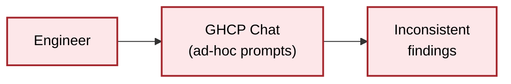
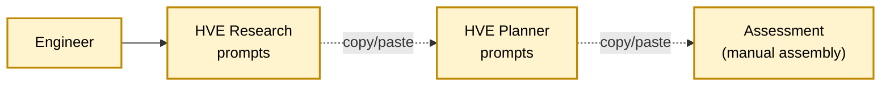
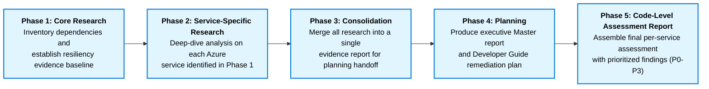

## Before HVE — Ad-hoc Copy/Paste

Engineers hand-wrote prompts in GitHub Copilot Chat per repository. Outputs were inconsistent across services, hard to compare, and labor-intensive to produce.

## Early HVE — Research + Planner with Manual Copy/Paste

HVE Research and Planner prompts standardized the questions, but engineers still drove each prompt by hand and copy/pasted intermediate artifacts between steps. Faster than ad-hoc, still slow and error-prone.

## Optimization — HVE Skill-Driven Workflow

The current state packages the entire workflow as a Copilot skill (`resiliency-research`) that chains the research, consolidation, planner, and assessment-builder prompts in a deterministic five-phase sequence. The engineer invokes the skill once; phase outputs flow forward as inputs to the next phase without manual transfer.

## Phase 1: Core Research

Phase 1 establishes the repository context and dependency inventory that every later phase depends on. It begins with `/hve-resiliency-researcher-0`, which frames the repository so subsequent prompts share a common understanding of scope and architecture. `/hve-resiliency-researcher-1a` then performs Azure service discovery, capturing both explicitly declared and implicitly used services, while `/hve-resiliency-researcher-1b` inventories external (non-Azure) dependencies. `/hve-resiliency-researcher-2` documents the region and availability-zone assumptions the codebase relies on, and `/hve-resiliency-researcher-3` analyzes dependency survivability under those assumptions. `/hve-resiliency-researcher-4` characterizes state, data, and consistency behavior, `/hve-resiliency-researcher-5` documents failure and degraded-mode behavior, and `/hve-resiliency-researcher-6` looks at shared and cross-repository dependencies that introduce coupling risks. The phase finishes with `/hve-resiliency-researcher-7-logging`, which validates logging and transaction-state observability needed to detect and recover from failure.

## Phase 2: Service-Specific Research

Phase 2 runs only the prompts that match the Azure services identified in Phase 1, producing one deep-dive resiliency analysis per service. The catalog covers Application Gateway (`/hve-resiliency-researcher-8-appgw`), Azure Functions (`/hve-resiliency-researcher-9-functions`), Key Vault (`/hve-resiliency-researcher-10-keyvault`), AKS with Istio (`/hve-resiliency-researcher-11-aks-istio`), Cosmos DB including the Mongo API (`/hve-resiliency-researcher-12-cosmosdb`), Azure SQL (`/hve-resiliency-researcher-13-sql`), Azure Cache for Redis (`/hve-resiliency-researcher-14-redis`), Azure Storage (`/hve-resiliency-researcher-15-storage`), Kafka and Event Hubs Kafka (`/hve-resiliency-researcher-16-kafka`), Networking (`/hve-resiliency-researcher-17-networking`), Entra ID (`/hve-resiliency-researcher-18-entraid`), and API Management (`/hve-resiliency-researcher-19-apim`). Each prompt focuses narrowly on the failure modes, redundancy options, and configuration evidence specific to its service.

## Phase 3: Consolidation

Phase 3 merges every artifact produced in Phases 1 and 2 into a single, unified evidence report that the Task Planner can consume without revisiting per-prompt outputs. It runs only `/hve-resiliency-researcher-consolidate`, which deduplicates findings, normalizes terminology, and ensures every claim retained in the consolidated report is still backed by evidence from an upstream artifact.

## Phase 4: Planning

Phase 4 translates the consolidated research evidence into actionable remediation deliverables. It runs three prompts in sequence: `/hve-resiliency-planner-0` seeds the planning context by locking the research evidence as fixed constraints, `/hve-resiliency-planner-1` produces the executive Master resiliency report for engineering leadership and program managers to prioritize remediation work, and `/hve-resiliency-planner-2` produces the Developer Guide with code-level remediation guidance for the engineers implementing the changes.

## Phase 5: Code-Level Assessment Report

Phase 5 assembles the final `Microsoft Assessment/<serviceName>-Code-Level-Resiliency-Assessment.md` deliverable through four append-only passes. `/hve-resiliency-assessment-builder-0` writes the report header, table of contents, and Section 1 (Assessment Overview). `/hve-resiliency-assessment-builder-1` appends Section 2 with the P0 and P1 resilient-focused recommendations — the highest-priority findings that block or materially weaken resiliency. `/hve-resiliency-assessment-builder-2` appends the remaining P2 and P3 resiliency findings along with Section 3 (Non-Resilient-focused recommendations covering maintainability and consistency). `/hve-resiliency-assessment-builder-3` closes the report by appending Section 4 (IaC Gap Analysis), Section 5 (Full Finding Matrix), and Section 6 (Microsoft Standards Alignment).
