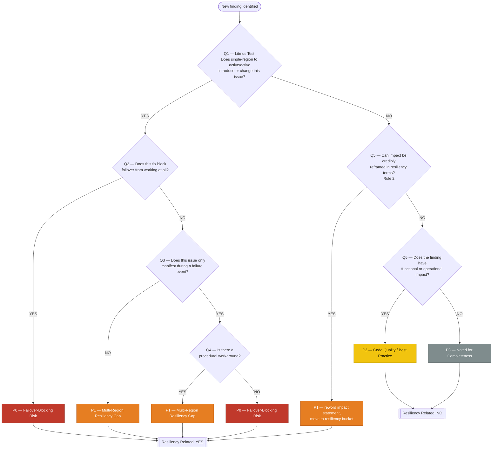
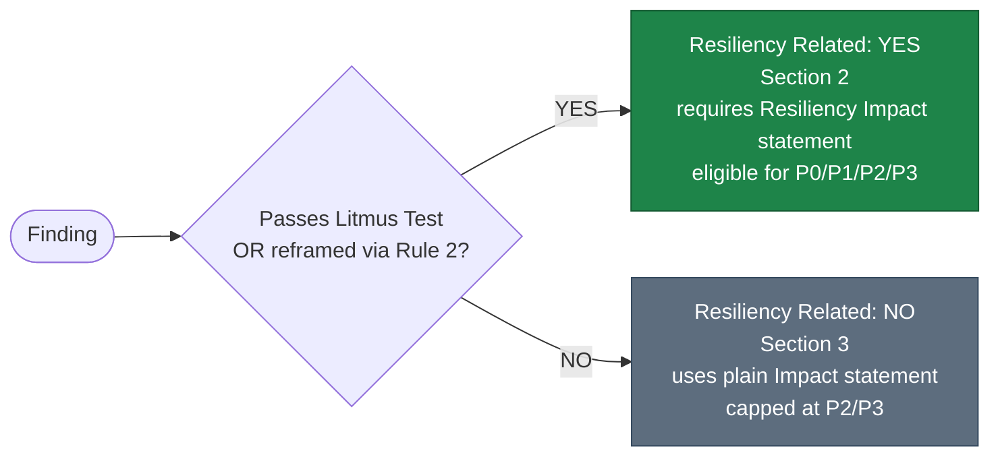

# Priority Classification — Decision Tree Diagrams

**OSPG Digital Payments — OSPG-PaymentTokenVault**

**Companion to:** OSPG-PaymentTokenVault-Priority-Classification-Decision-Tree.md

**Purpose:** Visual decision trees for the P0 / P1 / P2 / P3 priority classification and Resiliency vs Non-Resiliency categorization used across the assessment. Refer to the companion document for the written criteria, rules, and source authority.

**Provenance:** The classification logic shown in Diagrams 1 and 2 is **[OSPG]**-authored (the engagement-specific prompts and instructions). The pipeline in Diagram 3 is a **[Hybrid]**: the research → consolidate → plan workflow shell and `/clear` resets come from the **[HVE]** framework (`microsoft/hve-core`), while the priorities, resiliency split, and finding IDs flowing through it are **[OSPG]**. See the companion document, Section 9, for the full attribution.

**Version:** 1.0.0

---

## Table of Contents

1. [Classification Decision Tree](#1-classification-decision-tree)
2. [Resiliency vs Non-Resiliency Determination](#2-resiliency-vs-non-resiliency-determination)
3. [Classification Pipeline](#3-classification-pipeline)

---

## 1. Classification Decision Tree

**Provenance: [OSPG].** The exact algorithm applied to every finding to assign a P0–P3 priority.

> [!NOTE]
> **Rule 2 (referenced at Q5) — "resiliency wording is required."** A finding that fails the Litmus Test (Q1 = NO) gets one chance to enter the resiliency bucket: if its impact can be *credibly* stated as *"If you don't fix [X], then during a [failure scenario], [Y impact] occurs, which affects the resiliency of [client goal Z],"* it is reframed and promoted to **P1**. The reframe must be honest — a stretched or manufactured resiliency angle is not allowed — and it only ever raises a finding to P1, never P0.

[Back to Top](#top)

---

## 2. Resiliency vs Non-Resiliency Determination

**Provenance: [OSPG].** The `Resiliency Related: Yes / No` field decides whether a finding appears in Section 2 (Resilient Focused Recommendations) or Section 3 (Non-Resilient Focused Recommendations).

[Back to Top](#top)

---

## 3. Classification Pipeline

**Provenance: [Hybrid] — [HVE] workflow shell, [OSPG] content.** Where priorities are decided, finalized, locked, and rendered. Planning phases cannot reclassify or add findings.

```mermaid
flowchart LR
    R0[Researcher 0 / 0a
context frame] --> R1[1a / 1b
service discovery + scope]
    R1 --> RC[Prompts 2-7
core analysis]
    RC --> SVC[Service prompts 8-19
confirmed dependencies only]
    SVC --> CON[Consolidate
de-dup + Findings Index
PRIORITIES FINALIZED]
    CON --> LOCK[planner-0
evidence lock-in]
    LOCK --> M[planner-1
Master report, F-### IDs]
    M --> DG[planner-2
Developer Guide]
    DG --> ASMT[planner-3
Assessment: PX-NNN IDs,
Resiliency vs Non-Resiliency split,
Summary Findings Table]

    classDef decide fill:#2874a6,color:#fff,stroke:#1b4f72;
    classDef lock fill:#7d3c98,color:#fff,stroke:#512e5f;
    classDef render fill:#117a65,color:#fff,stroke:#0b5345;
    class CON decide;
    class LOCK lock;
    class M,DG,ASMT render;
```

[Back to Top](#top)
 