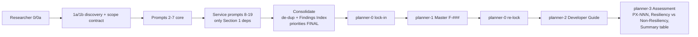

<!-- markdownlint-disable-file -->
# P0–P3 Priority Classification Logic — OSPG-PaymentTokenVault Code-Level Resiliency Assessment

## Research Topics / Questions

- Exact definitions and thresholds for each priority level (P0, P1, P2, P3).
- Decision rules for "Resiliency Related: Yes/No".
- Evidence-only / evidence lock-in rules.
- Classification guidance: failover-blocking vs material risk vs best-practice vs referential.
- The active/active context (West US + West US 2, zone failure, regional failover) that frames severity.
- Workflow: how findings flow research → consolidation → planner → final priorities.
- De-duplication rules.
- Relationship between the 17 researcher prompts and the 122 findings.

## Status

Complete. All requested topics answered from the workspace prompt/instruction/skill files and cross-checked against the generated assessment.

## Source Files Analyzed

- `.github/instructions/ospg-planner-context.instructions.md` (planner-side classification authority — the decision tree lives here)
- `.github/instructions/ospg-platform-context.instructions.md` (researcher-side priority definitions, exclusion rule, workflow sequence)
- `.github/skills/ospg-resiliency-research/SKILL.md` (workflow orchestration, priority definitions, deliverable templates)
- `.github/prompts/planner/ospg-hve-planner-0.prompt.md` (evidence lock-in seed)
- `.github/prompts/planner/ospg-hve-planner-1.prompt.md` (Executive/Master report; Finding ID assignment F-###)
- `.github/prompts/planner/ospg-hve-planner-2.prompt.md` (Developer Guide; code-level remediation)
- `.github/prompts/planner/ospg-hve-planner-3.prompt.md` (Code-Level Resiliency Assessment generator — Resiliency vs Non-Resiliency split, PX-NNN IDs, summary table)
- `.github/prompts/researcher/ospg-hve-researcher-0.prompt.md` (context frame, per-finding priority)
- `.github/prompts/researcher/ospg-hve-researcher-0a.prompt.md` (service nature / failover compatibility)
- `.github/prompts/researcher/ospg-hve-researcher-1a.prompt.md` (Azure service discovery / scope contract)
- `.github/prompts/researcher/ospg-hve-researcher-consolidate.prompt.md` (authoritative consolidation, de-dup rule)
- `.github/prompts/service/ospg-hve-researcher-10-keyvault.prompt.md` (per-service evidence rule sample)
- `.github/prompts/service/ospg-hve-researcher-16-kafka.prompt.md` (per-service evidence rule sample)
- `Microsoft Assessment/OSPG-PaymentTokenVault-Code-Level-Resiliency-Assessment.md` (the generated output; confirms 17 prompts → 122 findings and the count table)

---

## 1. Verbatim Priority Definitions (with file paths and line numbers)

There are **three layers** of priority definitions. They are consistent but worded differently for their phase. The **planner-context instructions are the authoritative classification source** (they contain the criteria and decision tree); the researcher-context and skill files carry shorter "failover-impact" definitions used during evidence gathering.

### 1A. Short Legend (used in all outputs)

`ospg-planner-context.instructions.md:111-116`:

```text
## Priority Legend

Use this consistently in all outputs:

* P0: Blocking/Critical Risk
* P1: High Priority
* P2: Improvement/Best Practice (Non-Blocking)
* P3: Non-Blocking Code Consistency (Best Practices / Maintainability)
```

### 1B. Authoritative Criteria-Based Definitions (Planner Context)

These contain the actual thresholds a reviewer applies.

**P0 — Critical Resiliency Risk** — `ospg-planner-context.instructions.md:118-129`:

```text
### P0 — Critical Resiliency Risk

**Definition**: The finding **blocks failover from functioning** or **renders the active/active deployment meaningless**. Without this fix, the investment in a second region provides no benefit.

**Criteria** (any of the following):

* Hard-coded region-specific values (connection strings, endpoints, IPs) where the application must switch from a single-region FQDN or IP to an abstracted listener/endpoint that covers both regions. The fix is to use the single abstracted endpoint (e.g., failover group listener) that routes to whichever region is active, not to add both region values.
* GLB health probes not yet implemented: health probe endpoints are net-new work required for the GLB to make informed failover decisions.
* Dependencies deployed in only one region with no plan for the second region: failing over gains nothing if the dependency does not exist in the target region.
* Connection strings pointing to single-region SQL Server FQDNs instead of failover group listener names.
* Application logic that assumes a specific region and breaks when executed in the other region.
* Prerequisites for other P0 resiliency fixes: if fixing A is required before fixing B, and B is P0, then A is also P0.
```

**P1 — Important Resiliency Risk** — `ospg-planner-context.instructions.md:131-140`:

```text
### P1 — Important Resiliency Risk

**Definition**: The finding is resiliency-related (passes the litmus test) but has a **procedural workaround**, **lower blast radius**, or **does not fully block failover**.

**Criteria** (any of the following):

* Issue only manifests during a failure event but can be manually remediated after the fact.
* Data integrity issues triggered by failover (e.g., duplicate transactions) that are detectable and reversible.
* Missing retry logic or error handling that causes degraded experience during failover but does not fully prevent operation.
* Resiliency improvements that are best-practice but not strictly required for failover to function.
```

**P2 — Code Quality / Non-Resiliency** — `ospg-planner-context.instructions.md:142-148`:

```text
### P2 — Code Quality / Non-Resiliency

**Definition**: The finding is a valid code issue but **behaves identically in single-region and active/active**. The multi-region deployment does not introduce, amplify, or change this issue.

**Important**: These findings should still be reported. But they do **not** belong in the resiliency bucket and should not be prioritized above P0/P1 resiliency items. Frame them as code-quality recommendations, not resiliency risks.

**Reclassification opportunity**: If the team can reframe the impact in resiliency terms (Rule 2) and the customer would agree it is resiliency-related, it may be moved to P1. If the reframing is a stretch, leave it at P2.
```

**P3 — Noted for Completeness** — `ospg-planner-context.instructions.md:150-158`:

```text
### P3 — Noted for Completeness

**Definition**: The finding has **no functional resiliency impact** and does not affect failover mechanics. It is retained per Rule 4 so the customer has a complete record.

**Criteria** (any of the following):

* Configuration hygiene items (naming inconsistencies, label mismatches) with no operational impact on failover.
* Non-resiliency observations from other domains (security, compliance) that fail the litmus test but are worth flagging.
* Referential or explanatory entries that describe how multiple findings interact but do not represent a discrete actionable fix.
```

### 1C. Researcher-Context Definitions (failover-impact phrasing)

`ospg-platform-context.instructions.md:22-27`:

```text
## Priority Definitions

* P0: Critical / Blocking. Causes outage, data loss, duplicate charges, or inability to fail over safely during zone or regional failure.
* P1: Required, Non-Blocking. Does not fully block failover but materially increases application risk, data risk, or customer impact during failure.
* P2: Improvement / Best Practice. Does not materially impact correctness during failover but weakens resilience posture or operational clarity.
* P3: Non-Blocking Code Consistency. Captures maintainability, readability, duplication, or inconsistent pattern issues that are non-blocking.
```

### 1D. Skill Definitions (orchestration copy)

`ospg-resiliency-research/SKILL.md:101-106`:

```text
## Priority Definitions

* P0: Critical / Blocking. Causes outage, data loss, duplicate charges, or inability to fail over safely.
* P1: Required, Non-Blocking. Materially increases application risk, data risk, or customer impact during failure.
* P2: Improvement / Best Practice. Does not materially impact correctness but weakens resilience posture.
* P3: Non-Blocking Code Consistency. Maintainability, readability, duplication, or inconsistent patterns that are non-blocking.
```

### 1E. Consolidation Definitions ("USE EXACTLY")

`ospg-hve-researcher-consolidate.prompt.md:31-44`:

```text
========================
PRIORITY DEFINITIONS (USE EXACTLY)
========================
- P0 — Blocking/Critical Risk
  Causes outage, data loss, duplicate charges, or inability to fail over safely during zone or regional failure.

- P1 — High Priority (Potential for Blocking)
  Does not fully block failover but materially increases MTTR, data risk, or customer impact during failure.

- P2 — Improvement/Best Practice (Non-Blocking)
  Does not materially impact correctness during failover but weakens resilience posture or operational clarity.

- P3 — Non-Blocking Code Consistency (Best Practices / Maintainability)
  Just a good practice
```

### 1F. Priority Labels Used in the Final Assessment

`ospg-hve-planner-3.prompt.md` (Priority labels by level):

```text
* P0: `Failover-Blocking Risk`
* P1: `Multi-Region Resiliency Gap`
* P2: `Code Quality / Best Practice`
* P3: `Code Consistency` or `Noted for Completeness`
```

The H2 priority block labels in the report are: `## P0 — Critical Resiliency Risks (N)`, `## P1 — High Priority Resiliency (N)`, `## P2 — Improvement / Best Practice (N)`, `## P3 — Code Consistency (N)`; Non-Resilient variants append `(Non-Resiliency)`.

---
 

 ## 2. The Full Decision-Logic Chain (How a Priority Is Assigned)

### 2.1 The Litmus Test (entry gate)

`ospg-planner-context.instructions.md:58-66`:

```text
### The Litmus Test

> **"Does going from single-region (West US with East US DR) to active/active (West US + West US 2) introduce or change this issue?"**

* If **YES**: the issue is resiliency-related ... **Categorize as a resiliency finding.**
* If **NO**: the behavior is identical whether the application runs in a single region or multiple regions. This is a code-quality or logic bug. **Do not categorize as resiliency** unless the issue can be reframed in terms of resiliency impact (see Rule 2 below).
```

### 2.2 The Four Rules (govern categorization vs priority)

`ospg-planner-context.instructions.md:68-87` (verbatim summary):

- **Rule 1 — Failover Is the Central Pillar.** If a finding does not interact with failover mechanics (GLB routing, health probes, region-aware config, cross-region dependency availability), it should drop in priority.
- **Rule 2 — Resiliency Wording Is Required.** Every resiliency-bucket finding must articulate impact as: *"If you don't fix [X], then during a [failure scenario], [Y impact] will occur, which affects the resiliency of [the client's ability to accomplish Z]."* If you cannot articulate a resiliency impact statement, the finding does not belong in the resiliency bucket.
- **Rule 3 — Failure-Triggered Issues Qualify.** If an issue only manifests because of a failure event (AZ failure, region failure, GLB failover), it qualifies as resiliency even if a workaround exists. *"The existence of a workaround affects priority (P1 vs P0), not categorization."*
- **Rule 4 — Include Everything, Let the Customer Decide.** All recommendations stay in the report regardless of expected acceptance (paper trail for CSAM).

### 2.3 The Categorization Decision Tree (the exact reviewer algorithm)

`ospg-planner-context.instructions.md:160-194` — this is the canonical step-by-step decision logic:

```text
START: New finding identified
  │
  ▼
Q1: Does moving from single-region (with passive DR) to active/active
    introduce or change this issue?
  │
  ├── YES ──► Q2: Does this fix block failover from working at all?
  │             │
  │             ├── YES ──► P0 — Critical Resiliency Risk
  │             │
  │             └── NO ──► Q3: Does this issue only manifest during a failure event?
  │                          │
  │                          ├── YES ──► Q4: Is there a procedural workaround?
  │                          │             │
  │                          │             ├── YES ──► P1 — Important Resiliency Risk
  │                          │             │
  │                          │             └── NO ──► P0 — Critical Resiliency Risk
  │                          │
  │                          └── NO ──► P1 — Important Resiliency Risk
  │
  └── NO ──► Q5: Can the impact be framed in resiliency terms (Rule 2)?
               │
               ├── YES (credibly) ──► P1 — Important Resiliency Risk
               │                       (reword the impact statement)
               │
               └── NO ──► Q6: Does the finding have functional or operational impact?
                            │
                            ├── YES ──► P2 — Code Quality / Non-Resiliency
                            │
                            └── NO ──► P3 — Noted for Completeness
```

**Decision chain narrative (what a reviewer follows):**

1. **Q1 (Litmus):** Does single-region → active/active introduce or change the issue?
   - **YES** → it is a resiliency finding → continue to Q2.
   - **NO** → not inherently resiliency → jump to Q5.
2. **Q2:** Does the fix block failover from working at all? **YES → P0.**
3. **Q3:** (only reached if Q2 = NO) Does the issue only manifest during a failure event?
   - **NO** → **P1**.
   - **YES** → continue to Q4.
4. **Q4:** Is there a procedural workaround?
   - **YES → P1** (workaround lowers priority, not category).
   - **NO → P0** (no workaround for a failure-only issue escalates back to P0).
5. **Q5:** (Q1 was NO) Can the impact be credibly reframed in resiliency terms per Rule 2? **YES → P1** (reword the impact statement and move into the resiliency bucket).
6. **Q6:** (Q5 was NO) Does the finding have functional/operational impact? **YES → P2**, **NO → P3**.

### 2.4 Special Case — Prerequisite Findings

`ospg-planner-context.instructions.md:196-203`:

```text
### Special Case: Prerequisite Findings

If a finding is **not itself a resiliency issue** but is a **required prerequisite** for another resiliency fix:

* Classify it at the same priority as the dependent resiliency finding.
* Note in the description: *"This is a prerequisite for [dependent finding ID/title]. ..."*
```

This is also baked into the P0 criteria list ("Prerequisites for other P0 resiliency fixes ... then A is also P0").

---
 

 ## 7. Workflow / Pipeline: Research → Consolidate → Plan → Assess

### 7.1 Phase sequence (`ospg-resiliency-research/SKILL.md` Required Workflow)

```text
Phase 1: Core Research (Prompts 0, 0a, 1[a/b], 2, 3, 4, 5, 6, 7-logging) — sequential, mandatory
Phase 2: Service-Specific Research (Prompts 8-19) — circumstantial; run only for dependencies confirmed in Prompt 1 Section 1
Phase 3: Consolidation (ospg-hve-researcher-consolidate) — merge all outputs into ONE authoritative research artifact
Phase 4: Planning (planner-0 lock-in → planner-1 Master → planner-0 re-lock → planner-2 Developer Guide)
         [planner-3 generates the Code-Level Resiliency Assessment from Master + Developer Guide + consolidated research]
```

Each step is separated by `/clear` (the researcher-context and skill enforce running `/clear` between prompts so each prompt operates on a clean context against the same repo).

### 7.2 Researcher next-step chain (`ospg-platform-context.instructions.md` Next Step table)

`researcher-0 → 0a → 1a → 1b → 2 → 3 → 4 → 5 → 6 → 7-logging → service prompts (8-19, applicable only) → consolidate → planner-0`.

### 7.3 Planner next-step chain (`ospg-planner-context.instructions.md` Next Step table)

`planner-0 → planner-1 → (/clear, planner-0 re-lock) → planner-2 → planner-3 (workflow complete)`.

### 7.4 Where classification is decided vs rendered

- **Decided (priority + Resiliency Yes/No):** at the researcher prompts (each finding gets a P0–P3) and **finalized/de-duplicated at consolidation** (`...consolidate.prompt.md`). Consolidation is the single authoritative artifact and Findings Index.
- **Locked:** planner-0 freezes the research as fixed constraints; planners cannot add or reinterpret findings.
- **Rendered:** planner-1 (Master, `F-###`), planner-2 (Developer Guide, code), planner-3 (Assessment, `PX-NNN`, Resiliency vs Non-Resiliency split, Summary Findings Table counts).



---

## 8. De-Duplication Rules

- **Consolidation de-dup (primary):** `ospg-hve-researcher-consolidate.prompt.md:28` — *"Do not duplicate findings across sections; reference the Finding ID."* And QUALITY BAR CHECK: *"Findings are internally consistent."* The consolidated report's **Section 9 Research Findings Index** is the canonical, de-duplicated list (`| Finding ID | Priority | Category | Short Description | Evidence (File:Line) |`).
- **Service Exclusion Rule (scope de-dup):** `ospg-platform-context.instructions.md:29-32` and `ospg-resiliency-research/SKILL.md:108-112` — after Prompt 1a/1b, dependencies in Section 2 (Checked But Not Present) and Section 3 (Not Applicable) are excluded; downstream prompts analyze **only Section 1 (evidence-confirmed) dependencies**. This prevents re-analysis of out-of-scope services.
- **Assessment ID uniqueness (render de-dup):** `ospg-hve-planner-3.prompt.md` Validation Checklist — *"Every finding has a unique `PX-NNN` ID; no duplicates"* and *"Finding counts in the Summary Findings Table match actual counts per section and priority."*
- The generated assessment describes the result as *"consolidated into 122 de-duplicated findings across P0–P3 priorities"* (assessment line 34).

---

## 9. Relationship: 17 Researcher Prompts → 122 Findings

The generated assessment states the methodology directly (line 34):

> *"This assessment was conducted using an evidence-only forensic methodology: 17 researcher prompts generated findings from code and configuration analysis, consolidated into 122 de-duplicated findings across P0–P3 priorities."*

- **17 researcher prompts** = the prompts that actually ran for this repo (Phase 1 core prompts that always run + the subset of Phase 2 service prompts whose dependency was confirmed in Prompt 1a/1b Section 1). The full catalog is larger (researcher 0, 0a, 1a, 1b, 2–6, 7-logging, consolidate + service prompts 8–19); service prompts only execute for confirmed dependencies, so the executed count for this repo netted to 17 generating prompts feeding the consolidation. Not every catalog prompt produces findings (e.g., a "None found" service is skipped from scope).
- **122 findings** = de-duplicated count after consolidation, distributed exactly as the assessment Summary Findings Table records (matches `ospg-hve-planner-3.prompt.md` Summary Findings Table schema):

| Section | Priority | Count | Description |
|---|---|---|---|
| Resiliency | P0 | 36 | Blocks failover from functioning or renders multi-region deployment meaningless |
| Resiliency | P1 | 34 | Materially increases risk during failure; procedural workarounds or limited blast radius |
| Resiliency | P2 | 14 | Weakens resilience posture; best-practice improvements for zone/region survivability |
| Resiliency | P3 | 4 | Referential entries or compound interaction descriptions |
| Non-Resiliency | P2 | 17 | Code quality, security hygiene, observability, and configuration improvements |
| Non-Resiliency | P3 | 17 | Security-only observations and configuration hygiene items |
| **Total** | | **122** | |

(Source: assessment lines 72–78. Sum: 36+34+14+4+17+17 = 122.)

Observations consistent with the classification logic:
- **No Non-Resiliency P0/P1 rows** — confirms that `Resiliency Related: No` findings can only be P2/P3 (Section 3 of the logic above).
- **P0 (36) is the largest bucket** — consistent with the critical framing that failover-blocking items are the highest priority and the "single-region dependency = P0" / "no health probes = P0" criteria.

---

## 10. Per-Finding Output Schema (where priority + category surface in the report)

`ospg-hve-planner-3.prompt.md` Individual Finding Template (field order fixed):

```text
1. #### PX-NNN: Short Title
2. **Priority: PX — {Priority Label}**
3. **Resiliency Related:** Yes / No
4. **Issue:**
5. **What does this solve:**
6. **Resiliency Impact:**  (Yes findings)  | **Impact:** (No findings)
7. **Recommended Fix:**
8. **File:** path:line  + current-code fenced block
9. **Fix:** + corrected-code fenced block
10. **Notes:**
11. **MSFT Reference:** (when a WAF/Azure pattern applies)
```

Field guidance ties back to the tree: Issue for **P0/P1** must explain how the issue is *introduced or worsened by single-region → active/active*; for **P2/P3** it must note that *behavior is identical regardless of topology*. `Resiliency Impact` must be framed in zone-failure / regional-failover terms and is **required for every Resiliency Related: Yes** finding.

---

## 11. Key Discoveries (Summary)

1. **Authoritative classifier = the planner-context decision tree** (`ospg-planner-context.instructions.md:160-194`). All other priority blurbs are phase-specific restatements.
2. **The Litmus Test is the gate** between Resiliency (Yes) and Non-Resiliency (No); Rule 2 allows a one-way reframe of a Non-Resiliency item up to P1.
3. **P0 vs P1 hinges on "blocks failover at all?" and "is there a workaround?"** — workaround presence demotes P0→P1 but never changes category (Rule 3).
4. **A `Resiliency Related: No` finding is capped at P2/P3** — it can never be P0/P1 (confirmed by the empty Non-Resiliency P0/P1 rows).
5. **Priority = failover impact, not effort** — explicit precedence rule.
6. **Single-region dependency and missing GLB health probes are hard-coded P0 criteria.**
7. **Prerequisites inherit the dependent finding's priority.**
8. **Consolidation is the de-dup + lock point;** planners render but cannot reclassify or add findings.
9. **Service Exclusion Rule** narrows scope to Section-1 (evidence-confirmed) dependencies before deep analysis, preventing duplicate/out-of-scope findings.
10. **17 executed researcher prompts → 122 de-duplicated findings** (P0 36 / P1 34 / Res-P2 14 / Res-P3 4 / Non-Res-P2 17 / Non-Res-P3 17).

---

## 12. Recommended Next Research (not completed this session)

- [ ] Map each of the 122 `PX-NNN` findings back to the originating researcher prompt (no traceability column exists in the assessment; would require parsing `subagents/` research files).
- [ ] Confirm the exact identity of the "17 researcher prompts" that executed for this repo vs the full ~21-prompt catalog (which service prompts were skipped due to absent dependencies).
- [ ] Verify whether any finding was reclassified between consolidation priority and final assessment priority (drift check between `*-research.md`, `*-Master.md`, and the assessment).

## 13. Clarifying Questions

- None blocking. (Open item only: line numbers above for the planner-context instructions are derived from the read ranges of `ospg-planner-context.instructions.md`; if exact line anchors are needed for citation in a deliverable, re-open the file and confirm the current line numbers, since the file may have shifted.)
 
 